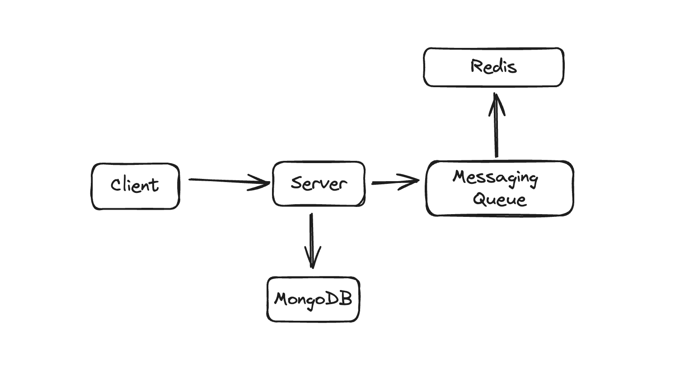

# 🗺️ Map Capture and 3D Visualization App

This project is a MERN (MongoDB, Express.js, React.js, Node.js) stack application that allows users to capture map regions and visualize them on a 3D cuboid.

Link : [mapcap.vercel.app](mapcap.vercel.app)

## ✨ Features

- 🌍 Interactive map selection using Google Maps or Mapbox
- 📸 Capture visible map region as an image
- 🧊 Apply captured image as a texture on a 3D cuboid using BabylonJS
- 💾 Save and retrieve map captures
- 📊 Identify top 3 most frequently captured regions for last 24 hours and all time.
- ⚡ Caching mechanism for improved performance
- 🔐 User authentication and authorization
- ✏️ Annotation functionality for maps

## 🛠️ Technologies Used

- Frontend: React.js, Google Maps/Mapbox API, BabylonJS
- Backend: Node.js, Express.js
- Database: MongoDB
- Authentication: JSON Web Tokens (JWT)

## 🚀 Setup and Installation

1. Clone the repository:

   ```
   git clone https://github.com/deveshXm/MapCapture
   cd MapCapture
   ```

2. Install Dependencies
   1. client
      ```
      npm install
      ```
   1. server
      ```
      npm install
      ```
3. Setup env using template present in project
4. Run server
   1. client
      ```
      npm run dev
      ```
   2. server
      ```
      npm run dev
      ```

## 📖 Usage

1. Navigate to `http://localhost:5173` in your web browser.
2. Log in or create an account.
3. Use the map to select a region of interest.
4. View the captured region applied as a texture on a 3D cuboid.
5. Access previously saved captures and annotations.

## Loom Video

<div style="position: relative; padding-bottom: 56.25%; height: 0;"><iframe src="https://www.loom.com/embed/1cdaefe21ce140ea9a902a25bf62a833?sid=254f2d71-52e7-4e6e-9ef1-92ef41448dd3" frameborder="0" webkitallowfullscreen mozallowfullscreen allowfullscreen style="position: absolute; top: 0; left: 0; width: 100%; height: 100%;"></iframe></div>

## 🔌 API Endpoints

- `POST /api/maps/`: Save a new map capture
- `GET /api/maps/user/?page=1`: Retrieve all captures for the authenticated user
- `GET /api/maps/top`: Get top 3 most frequently captured regions of all time
- `GET /api/maps/top24h` : Get top 3 most frequently captured regions from last 24 hour
- `POST /api/user/register`: Register a new user
- `POST /api/user/login`: Log in a user

## High Levle Architecture



## 🚀 Algorithm Implementation and Caching Strategy

### Why We Choose to Save Location in MongoDB as Geohash

**Geohashing** is a strategic choice for encoding geographic locations into a short string of letters and numbers, particularly beneficial for applications involving frequent access to top regions and requiring scalability:

1. **Efficient Indexing and Quick Access**: Geohashes facilitate efficient indexing in MongoDB. This efficiency is crucial for quickly accessing the most frequently visited regions, as it allows for fast lookups and aggregation of data based on geohash prefixes.

2. **Scalability with High Performance**: Geohashing simplifies the scaling of spatial data. As data volume grows, geohashes maintain performance without the need for complex spatial computations, making it ideal for applications that need to scale while still providing quick responses.

3. **Optimized for Caching**: Geohashes are inherently suitable for caching mechanisms. The uniformity and predictability of geohash strings allow for effective caching strategies, where frequently accessed geohash regions can be cached to speed up query responses without frequent database hits.

#### Reasons for Not Using Other Methods

- **$geoNear and Complex Geospatial Queries**: Not used due to their computational overhead. While precise, these methods can degrade performance when dealing with very large datasets and frequent queries, which is critical in scenarios requiring real-time data access.

- **External Spatial Libraries**: Avoided to minimize external dependencies and complexity, focusing instead on MongoDB's robust, native handling of geohashed data which provides sufficient precision for most use cases without additional overhead.

- **Advanced Geospatial Indexing**: While powerful, more complex geospatial indexing features of MongoDB were not utilized to keep the system lightweight and maintain faster response times, especially under heavy load conditions.

By leveraging geohashing, we ensure that our system remains efficient and scalable, capable of handling frequent accesses to top regions effectively. This approach not only optimizes performance but also simplifies the caching strategy, crucial for applications demanding high availability and speed.

### Caching Strategy for Top Trending Regions ( last 24 hours)

Our caching strategy is designed to balance data freshness, query performance, and system resource utilization. Here's a detailed breakdown of our approach:

#### 1. Multi-Level Caching

We implement a two-tier caching system:

a) **Redis Sorted Sets (Primary Cache)**

- Stores raw geohash frequency data
- Updated in real-time with each new data point
- Retains granular, hourly data for the last 24 hours

b) **Processed Results Cache**

- Stores the computed top trending regions
- Updated periodically or on-demand
- Serves as a quick-access cache for frequent queries

#### 2. Time-Based Data Management

- **Hourly Buckets**: Data is segmented into hourly buckets, allowing for precise time-based queries and efficient data expiration.
- **Sliding Window**: The system maintains a rolling 24-hour window, automatically expiring old data.
- **TTL (Time-To-Live)**: Each hourly bucket has a 26-hour TTL, ensuring automatic cleanup of outdated data.

#### 3. Cache Update Mechanisms

a) **Write-Through Caching**

- Every new geohash immediately updates the corresponding hourly bucket in Redis
- Ensures the primary cache (Redis Sorted Sets) is always up-to-date

b) **Lazy Loading for Processed Results**

- The top trending regions are computed on-demand
- Results are then cached with a short TTL (e.g., 5 minutes)
- Subsequent requests within the TTL period serve the cached results

c) **Periodic Background Updates**

- An optional background job can precompute and update the trending regions cache at regular intervals (e.g., every 5 minutes)
- Helps in reducing latency for user requests at the cost of slightly increased system load

#### 4. Cache Invalidation

- **Time-Based Invalidation**: The processed results cache automatically invalidates after its short TTL
- **Manual Invalidation**: Provides an endpoint to force-refresh the cache if needed (e.g., for administrative purposes)

#### 5. Fallback Mechanism

- If Redis is unavailable or returns no data, the system falls back to querying the main database (MongoDB)
- This ensures system resilience and data availability, albeit with potentially higher latency

#### 6. Memory Management

- **Set Size Limitation**: Each hourly bucket is capped at a maximum number of elements (e.g., 240)
- **Least Frequently Used (LFU) Eviction**: When a set reaches its size limit, the least frequent geohashes are evicted
- This approach ensures that memory usage remains bounded while retaining the most relevant data

#### 7. Cache Consistency

- The system prioritizes eventual consistency
- Real-time updates are reflected in the primary cache (Redis Sorted Sets) immediately
- The processed results cache may have a short lag (up to its TTL duration) in reflecting the very latest data

This caching strategy enables our system to handle high traffic efficiently, provide near-real-time trending data, and maintain a good balance between data freshness and system performance. It's designed to be scalable and resilient, with built-in mechanisms to handle data expiration, memory management, and system failures.

### Algorithm

We use Redis Sorted Sets to store and manage geohash data. Each hourly period is represented by a separate sorted set, with the following structure:

- Key: `geohash:{YYYYMMDD}_{HH}`
- Members: Geohash strings
- Scores: Frequency counts

#### Core Components

- **Geohash Recorder**

  - Increments geohash counts in the current hour's sorted set
  - Manages set size to prevent unbounded growth

- **Top Regions Retriever**

  - Aggregates data from the last 24 hourly sets
  - Computes and caches the top trending regions

- **In-Memory Queue**
  - Buffers incoming geohash data
  - Ensures reliable processing during traffic spikes

#### Key Algorithms

- **Geohash Recording**

```typescript
async function recordGeohash(geohash: string) {
  const key = getCurrentHourKey();
  await redisClient.zIncrBy(key, 1, geohash);
  await redisClient.expire(key, 26 * 60 * 60); // 26 hours TTL

  const setSize = await redisClient.zCard(key);
  if (setSize > MAX_SET_SIZE) {
    await redisClient.zRemRangeByRank(key, 0, setSize - MAX_SET_SIZE - 1);
  }
}
```

- Increments the geohash count in the current hour's set
  Sets a 26-hour expiration on the set
  Trims the set if it exceeds the maximum size

- **Top Regions Retrieval**

```typescript
async function getTopRegions24H() {
  const keys = getLast24HourKeys();
  const tempKey = "temp_top_regions";

  await redisClient.zUnionStore(tempKey, keys);
  const topGeohashes = await redisClient.zRevRange(tempKey, 0, 2, "WITHSCORES");
  await redisClient.del(tempKey);

  return processResults(topGeohashes);
}
```

- This function combines data from the last 24 hourly sets Retrieves the top 3 geohashes
  Processes and returns the results

#### Optimizations

- **Set Size Limitation**: Each hourly set is capped at a maximum size (e.g., 240 elements) to prevent unbounded growth and ensure efficient operations.
  Sliding Window: By using hourly sets, we maintain a precise 24-hour sliding window without the need for complex data structure management.

- **Caching** : The results of getTopRegions24H are cached with a short TTL, reducing computation for frequent requests.
  Asynchronous Processing: An in-memory queue buffers incoming geohash data, allowing for smooth handling of traffic spikes.

#### Performance Considerations

- **Write Operations** : O(log(N)) complexity for each geohash increment, where N is the set size.

- **Read Operations** : O(K log(N) + M log(M)) for retrieving top regions, where K is the number of hourly sets, N is the average set size, and M is the number of unique geohashes across all sets.

#### Scalability

- This system is designed to handle high write throughput and frequent read operations.

- It can be further scaled by implementing Redis clusters for distributed data storage
  Using read replicas to offload read operations
  Increasing the granularity of time buckets for extremely high traffic scenarios

### Top Trending Regions of All Time

We have implemented an algorithm to identify the top three most frequently captured regions of all time. This algorithm is designed to be efficient and scalable, even with large datasets. The results of this algorithm are cached in Redis and updated every 24 hours using a cron job.

#### Algorithm Logic and Thoughts

1. **Cache Check**: The algorithm first checks if the data is available in the Redis cache. This step is crucial for performance optimization as it allows us to serve frequently requested data quickly without querying the database repeatedly.

2. **Mutex for Cache Stampede Prevention**: If the data is not in the cache, a mutex is used to prevent a cache stampede. A cache stampede occurs when multiple processes simultaneously query the database because the cache is empty, leading to a sudden spike in database load. The mutex ensures that only one process fetches the data from the database and updates the cache, while other processes wait for the cache to be populated.

3. **Database Query**: If the data is not in the cache, the algorithm fetches the top regions from the MongoDB database using an aggregation pipeline. The pipeline groups the data by geohash, counts the occurrences, sorts them in descending order, and limits the result to the top three regions. This approach leverages MongoDB's powerful aggregation framework, which is well-suited for this type of query.

4. **Cache Update**: The fetched data is then stored in the Redis cache with a TTL (Time-To-Live) to ensure it is updated every 24 hours. This step ensures that the cache remains fresh and reflects the most recent data.

#### Reasons for Choosing This Approach

1. **Simplicity and Efficiency**: The chosen approach is straightforward and leverages MongoDB's built-in capabilities for aggregation. This makes it easy to implement and maintain, while also being efficient for the task at hand.

2. **Scalability**: The algorithm is designed to handle large datasets efficiently. By using MongoDB's aggregation framework, we can perform complex queries directly on the database without the need for additional data processing frameworks.

3. **Performance Optimization**: The use of Redis for caching ensures that frequently requested data is served quickly, reducing the load on the database and improving the overall performance of the application.

4. **Contextual Fit with MongoDB**: MongoDB's aggregation framework allows efficient querying and aggregation operations directly on stored geohash data. The chosen approach aligns well with MongoDB's capabilities for real-time data aggregation and querying, making it a pragmatic choice for integrating frequency estimation into MongoDB-based applications.

#### Reasons for Not Choosing Other Algorithms

1. **FP-Growth Algorithm**: FP-Growth is powerful for finding frequent itemsets in transactional data, but it's not directly suited for counting individual items like geohashes without extensive adaptation. It also typically requires all data to fit into memory, which might not be feasible for large-scale geohash datasets.

2. **Apriori Algorithm**: Similar to FP-Growth, Apriori is designed for mining frequent itemsets rather than directly counting individual items. It involves generating candidate itemsets and performing multiple passes over the data, which can be computationally expensive and memory-intensive.

3. **Distributed Computing Frameworks (e.g., Apache Spark)**: While powerful for large-scale data processing, setting up and managing a distributed computing environment adds complexity and overhead. For scenarios where MongoDB serves as the primary data store, integrating a distributed framework might be over-engineering unless the dataset size mandates it.

By implementing this algorithm and caching strategy, we ensure that the application can efficiently handle large datasets and provide quick responses to the end-users. This approach strikes a balance between simplicity, efficiency, and scalability, making it well-suited for our use case.

## Caching Strategy for Top 3 Regions of All Time

In addition to tracking trending regions over the last 24 hours, our system also maintains a cache for the top 3 regions of all time. This presents different challenges and requires a distinct approach.

### Data Structure

We use a Redis Sorted Set to store the all-time geohash frequencies:

- Key: `geohash:all_time`
- Members: Geohash strings
- Scores: All-time frequency counts

### Caching Mechanism

1. **Incremental Updates**

   - Every new geohash saves the score in the all-time sorted set
   - This ensures the data is always up-to-date without need for periodic full recalculations

   ```typescript
   async function incrementAllTimeGeohash(geohash: string) {
     await redisClient.setEx("topRegions", geohash);
   }
   ```

2. **Top Regions Retrieval**

   - The top 3 regions are fetched directly from the sorted set
   - Results are cached in a separate key for quick access.

### Optimization Techniques

1. **Cached Results with TTL**

   - The processed top 3 regions are cached with a TTL (1 hour).
   - This reduces computation for frequent requests while ensuring data doesn't become stale.

2. **Background Update Job**

   - An optional background job can update the cached top regions periodically (1 hour)
   - This ensures the cached data is fresh even if there are no user requests.

3. **Consistency Considerations**

   - The all-time data is eventually consistent.
   - The cached top 3 regions may have a slight delay in reflecting recent changes (up to the cache TTL - 1 hour)

### Fallback Mechanism

- If Redis is unavailable, we fall back to querying the main database (MongoDB)
- This query would aggregate all-time data, which could be slow for large datasets
- To mitigate this, we could maintain a periodically updated summary in MongoDB

### Memory Management

- We only store geohashes that have a chance of being in the top 3, significantly reducing memory usage

This caching strategy for all-time top regions balances the need for up-to-date data with efficient resource utilization. It provides quick access to the top regions while managing memory usage and ensuring system resilience.

## Flow Chart

Below is a simple flow chart to illustrate the working of the algorithm:

```plaintext
+-------------------+
| Start             |
+-------------------+
         |
         v
+-------------------+
| Check Redis Cache |
+-------------------+
         |
         v
+-----------------------------+
| Data in Cache?              |
| (Yes)       |       (No)    |
+-----------------------------+
         |                    |
         v                    v
+-------------------+   +-------------------+
| Return Cached Data|   | Acquire Mutex     |
+-------------------+   +-------------------+
                              |
                              v
                      +-------------------+
                      | Check Redis Cache |
                      | Again             |
                      +-------------------+
                              |
                              v
                      +-----------------------------+
                      | Data in Cache?              |
                      | (Yes)       |       (No)    |
                      +-----------------------------+
                              |                    |
                              v                    v
                      +-------------------+   +-------------------+
                      | Return Cached Data|   | Fetch Data from DB|
                      +-------------------+   +-------------------+
                                                      |
                                                      v
                                              +-------------------+
                                              | Update Redis Cache|
                                              +-------------------+
                                                      |
                                                      v
                                              +-------------------+
                                              | Return Data       |
                                              +-------------------+
```

### Future Improvements

- Implement cache warming strategies to pre-populate the cache after clearing or on cold starts.
- Add monitoring for cache hit/miss rates to fine-tune update frequency.
- Explore sharding strategies for Redis as data volume grows.

This caching strategy provides a good balance between performance, data freshness, and system complexity, making it well-suited for our current needs while allowing for future scalability.

## 🔮 Future Improvements

- Implement cache warming strategies to pre-populate the cache after clearing or on cold starts.
- Add monitoring for cache hit/miss rates to fine-tune update frequency.
- Explore sharding strategies for Redis as data volume grows.

This caching strategy provides a good balance between performance, data freshness, and system complexity, making it well-suited for our current needs while allowing for future scalability.

## 🤝 Contributing

Contributions are welcome! Please feel free to submit a Pull Request.

## 📄 License

You don't need one.
