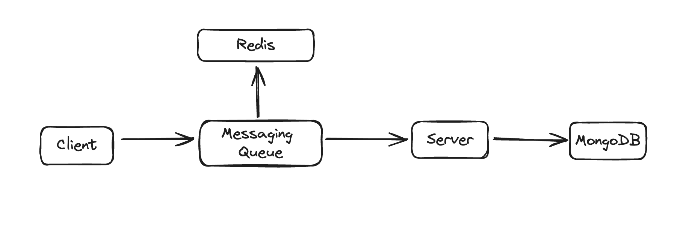

# 🗺️ Map Capture and 3D Visualization App

This project is a MERN (MongoDB, Express.js, React.js, Node.js) stack application that allows users to capture map regions and visualize them on a 3D cuboid.

Link : [mapcap.vercel.app](mapcap.vercel.app)

## ✨ Features
- 🌍 Interactive map selection using Google Maps or Mapbox
- 📸 Capture visible map region as an image
- 🧊 Apply captured image as a texture on a 3D cuboid using BabylonJS
- 💾 Save and retrieve map captures
- 📊 Identify top 3 most frequently captured regions for last 24 hours and all time.
- ⚡ Caching mechanism for improved performance
- 🔐 User authentication and authorization
- ✏️ Annotation functionality for maps

## 🛠️ Technologies Used

- Frontend: React.js, Google Maps/Mapbox API, BabylonJS
- Backend: Node.js, Express.js
- Database: MongoDB
- Authentication: JSON Web Tokens (JWT)

## 🚀 Setup and Installation

1. Clone the repository:

   ```
   git clone https://github.com/deveshXm/MapCapture
   cd MapCapture
   ```

2. Install Dependencies
   1. client
      ```
      npm install
      ```
   1. server
      ```
      npm install
      ```
3. Setup env using template present in project
4. Run server
   1. client
      ```
      npm run dev
      ```
   2. server
      ```
      npm run dev
      ```

## 📖 Usage

1. Navigate to `http://localhost:5173` in your web browser.
2. Log in or create an account.
3. Use the map to select a region of interest.
4. View the captured region applied as a texture on a 3D cuboid.
5. Access previously saved captures and annotations.

## 🔌 API Endpoints

- `POST /api/maps/`: Save a new map capture
- `GET /api/maps/user/?page=1`: Retrieve all captures for the authenticated user
- `GET /api/maps/top`: Get top 3 most frequently captured regions of all time
- `GET /api/maps/top24h` : Get top 3 most frequently captured regions from last 24 hour
- `POST /api/user/register`: Register a new user
- `POST /api/user/login`: Log in a user

## High Levle Architecture



## 🚀 Algorithm Implementation and Caching Strategy

### Why We Choose to Save Location in MongoDB as Geohash

**Geohashing** is a strategic choice for encoding geographic locations into a short string of letters and numbers, particularly beneficial for applications involving frequent access to top regions and requiring scalability:

1. **Efficient Indexing and Quick Access**: Geohashes facilitate efficient indexing in MongoDB. This efficiency is crucial for quickly accessing the most frequently visited regions, as it allows for fast lookups and aggregation of data based on geohash prefixes.

2. **Scalability with High Performance**: Geohashing simplifies the scaling of spatial data. As data volume grows, geohashes maintain performance without the need for complex spatial computations, making it ideal for applications that need to scale while still providing quick responses.

3. **Optimized for Caching**: Geohashes are inherently suitable for caching mechanisms. The uniformity and predictability of geohash strings allow for effective caching strategies, where frequently accessed geohash regions can be cached to speed up query responses without frequent database hits.

#### Reasons for Not Using Other Methods

- **$geoNear and Complex Geospatial Queries**: Not used due to their computational overhead. While precise, these methods can degrade performance when dealing with very large datasets and frequent queries, which is critical in scenarios requiring real-time data access.

- **External Spatial Libraries**: Avoided to minimize external dependencies and complexity, focusing instead on MongoDB's robust, native handling of geohashed data which provides sufficient precision for most use cases without additional overhead.

- **Advanced Geospatial Indexing**: While powerful, more complex geospatial indexing features of MongoDB were not utilized to keep the system lightweight and maintain faster response times, especially under heavy load conditions.

By leveraging geohashing, we ensure that our system remains efficient and scalable, capable of handling frequent accesses to top regions effectively. This approach not only optimizes performance but also simplifies the caching strategy, crucial for applications demanding high availability and speed.

### Caching Strategy

To enhance the performance of frequently accessed map data, we have implemented a caching mechanism using Redis. This approach helps in reducing the load on the database and improves the response time for the end-users. The caching strategy involves storing the results of computationally expensive queries in Redis and updating the cache at regular intervals.

### Top Trending Regions of the Last 24 Hours

We have implemented an algorithm to identify the top three most frequently captured regions in the last 24 hours. This algorithm is designed to be efficient and scalable, even with large datasets. The results of this algorithm are cached in Redis and updated every hour using a cron job.

#### Algorithm Logic and Thoughts

1. **Bucketization**: The approach uses hourly buckets (sorted sets) to store statistics. This allows for efficient sliding window operations and easier data management. Each hourly bucket contains the geohash counts for that specific hour.

2. **Write Efficiency**:

   - **ZADD with INCR and EX**: We use the ZADD command with the INCR and EX options in a single operation to increment the geohash count and set an expiry time. This reduces the number of Redis calls and ensures that old data is automatically cleaned up.
   - **Set Size Limitation**: We set a maximum size (e.g., 240) for each hourly set. If the set size exceeds this threshold, we remove the lowest-scoring elements to keep the set size manageable.

3. **Read Efficiency**:

   - **ZUNIONSTORE**: To get the top regions for the last 24 hours, we use the ZUNIONSTORE command to combine the hourly buckets. This operation is optimized by removing unnecessary elements before the union.
   - **Caching the Result**: The result of the union operation is cached for faster subsequent reads within the same hour.

4. **Memory Optimization**:

   - **Trimming During Increment**: Every time we increment a geohash count, we check if the set size exceeds the threshold. If it does, we remove the lowest-scoring elements.
   - **Trimming Before Union**: Before combining the hourly sets, we trim each set to the threshold size.
   - **Trimming After Union**: After combining the sets, we trim the resulting set if it exceeds the threshold.

5. **Cache Update**: The fetched data is then stored in the Redis cache with a TTL (Time-To-Live) to ensure it is updated every hour. This step ensures that the cache remains fresh and reflects the most recent data.

#### Reasons for Choosing This Approach

1. **Efficiency and Scalability**: The chosen approach leverages Redis's capabilities for real-time data aggregation and querying, making it highly efficient and scalable for handling large datasets.

2. **Performance Optimization**: Using Redis for caching ensures that frequently requested data is served quickly, reducing the load on the database and improving the overall performance of the application.

#### Reasons for Not Choosing Other Algorithms

1. **Redis TopK**: While Redis TopK provides efficient top-k queries, it does not inherently support the temporal component required for our use case, which involves tracking data over the last 24 hours with hourly granularity.

2. **MapReduce**: MapReduce could be used for processing large datasets, but it typically involves a more complex setup and is better suited for batch processing rather than real-time data querying and aggregation.

3. **FP-Growth and Apriori Algorithms**: These algorithms are primarily used for finding frequent itemsets and association rules in transactional datasets. They are not optimized for the specific task of counting and ranking geohashes based on their frequency over a defined time window.

By implementing this algorithm and caching strategy, we ensure that the application can efficiently handle large datasets and provide quick responses to the end-users. This approach strikes a balance between simplicity, efficiency, and scalability, making it well-suited for our use case.

### Top Trending Regions of All Time

We have implemented an algorithm to identify the top three most frequently captured regions of all time. This algorithm is designed to be efficient and scalable, even with large datasets. The results of this algorithm are cached in Redis and updated every 24 hours using a cron job.

#### Algorithm Logic and Thoughts

1. **Cache Check**: The algorithm first checks if the data is available in the Redis cache. This step is crucial for performance optimization as it allows us to serve frequently requested data quickly without querying the database repeatedly.

2. **Mutex for Cache Stampede Prevention**: If the data is not in the cache, a mutex is used to prevent a cache stampede. A cache stampede occurs when multiple processes simultaneously query the database because the cache is empty, leading to a sudden spike in database load. The mutex ensures that only one process fetches the data from the database and updates the cache, while other processes wait for the cache to be populated.

3. **Database Query**: If the data is not in the cache, the algorithm fetches the top regions from the MongoDB database using an aggregation pipeline. The pipeline groups the data by geohash, counts the occurrences, sorts them in descending order, and limits the result to the top three regions. This approach leverages MongoDB's powerful aggregation framework, which is well-suited for this type of query.

4. **Cache Update**: The fetched data is then stored in the Redis cache with a TTL (Time-To-Live) to ensure it is updated every 24 hours. This step ensures that the cache remains fresh and reflects the most recent data.

#### Reasons for Choosing This Approach

1. **Simplicity and Efficiency**: The chosen approach is straightforward and leverages MongoDB's built-in capabilities for aggregation. This makes it easy to implement and maintain, while also being efficient for the task at hand.

2. **Scalability**: The algorithm is designed to handle large datasets efficiently. By using MongoDB's aggregation framework, we can perform complex queries directly on the database without the need for additional data processing frameworks.

3. **Performance Optimization**: The use of Redis for caching ensures that frequently requested data is served quickly, reducing the load on the database and improving the overall performance of the application.

4. **Contextual Fit with MongoDB**: MongoDB's aggregation framework allows efficient querying and aggregation operations directly on stored geohash data. The chosen approach aligns well with MongoDB's capabilities for real-time data aggregation and querying, making it a pragmatic choice for integrating frequency estimation into MongoDB-based applications.

#### Reasons for Not Choosing Other Algorithms

1. **FP-Growth Algorithm**: FP-Growth is powerful for finding frequent itemsets in transactional data, but it's not directly suited for counting individual items like geohashes without extensive adaptation. It also typically requires all data to fit into memory, which might not be feasible for large-scale geohash datasets.

2. **Apriori Algorithm**: Similar to FP-Growth, Apriori is designed for mining frequent itemsets rather than directly counting individual items. It involves generating candidate itemsets and performing multiple passes over the data, which can be computationally expensive and memory-intensive.

3. **Distributed Computing Frameworks (e.g., Apache Spark)**: While powerful for large-scale data processing, setting up and managing a distributed computing environment adds complexity and overhead. For scenarios where MongoDB serves as the primary data store, integrating a distributed framework might be over-engineering unless the dataset size mandates it.

By implementing this algorithm and caching strategy, we ensure that the application can efficiently handle large datasets and provide quick responses to the end-users. This approach strikes a balance between simplicity, efficiency, and scalability, making it well-suited for our use case.

## Flow Chart

Below is a simple flow chart to illustrate the working of the algorithm:

```plaintext
+-------------------+
| Start             |
+-------------------+
         |
         v
+-------------------+
| Check Redis Cache |
+-------------------+
         |
         v
+-----------------------------+
| Data in Cache?              |
| (Yes)       |       (No)    |
+-----------------------------+
         |                    |
         v                    v
+-------------------+   +-------------------+
| Return Cached Data|   | Acquire Mutex     |
+-------------------+   +-------------------+
                              |
                              v
                      +-------------------+
                      | Check Redis Cache |
                      | Again             |
                      +-------------------+
                              |
                              v
                      +-----------------------------+
                      | Data in Cache?              |
                      | (Yes)       |       (No)    |
                      +-----------------------------+
                              |                    |
                              v                    v
                      +-------------------+   +-------------------+
                      | Return Cached Data|   | Fetch Data from DB|
                      +-------------------+   +-------------------+
                                                      |
                                                      v
                                              +-------------------+
                                              | Update Redis Cache|
                                              +-------------------+
                                                      |
                                                      v
                                              +-------------------+
                                              | Return Data       |
                                              +-------------------+
```

### Future Improvements

- Implement cache warming strategies to pre-populate the cache after clearing or on cold starts.
- Add monitoring for cache hit/miss rates to fine-tune update frequency.
- Explore sharding strategies for Redis as data volume grows.

This caching strategy provides a good balance between performance, data freshness, and system complexity, making it well-suited for our current needs while allowing for future scalability.

## 🔮 Future Improvements

- Implement cache warming strategies to pre-populate the cache after clearing or on cold starts.
- Add monitoring for cache hit/miss rates to fine-tune update frequency.
- Explore sharding strategies for Redis as data volume grows.

This caching strategy provides a good balance between performance, data freshness, and system complexity, making it well-suited for our current needs while allowing for future scalability.

## 🤝 Contributing

Contributions are welcome! Please feel free to submit a Pull Request.

## 📄 License

You don't need one.
